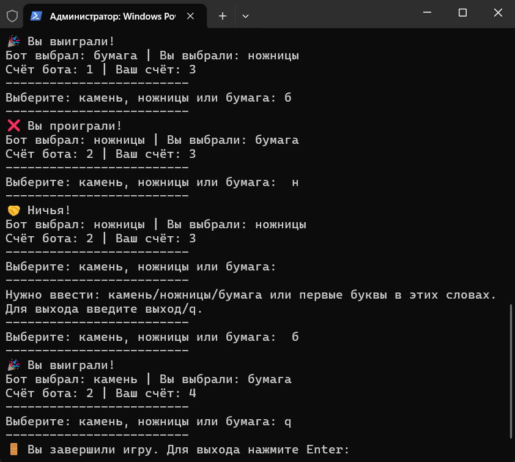

# Камень, ножницы, бумага

Консольная игра «Камень, ножницы, бумага», написанная на Go.

Игра предназначена для запуска в терминале. Игрок выбирает камень, ножницы или бумагу, после чего компьютер случайным образом выбирает свой вариант. После каждого раунда обновляется счёт.

## Возможности

* Игра против компьютера
* Случайный выбор компьютера
* Подсчёт очков игрока и компьютера
* Проверка корректности ввода
* Поддержка полных названий:

  * `камень`
  * `ножницы`
  * `бумага`
* Поддержка коротких команд:

  * `к` — камень
  * `н` — ножницы
  * `б` — бумага
* Игнорирование регистра и лишних пробелов
* Выход из игры командами `q` или `выход`

## Демонстрация



## Как играть

Запустите программу и выберите один из вариантов:

* `камень`
* `ножницы`
* `бумага`

Или используйте короткие команды:

* `к` — камень
* `н` — ножницы
* `б` — бумага

После этого компьютер сделает свой выбор, и программа определит результат раунда.

Для выхода из игры введите:

* `q`
* `выход`


## Запуск

Для запуска игры без создания исполняемого файла:

```bash
go run .
```

## Сборка

Для создания исполняемого файла:

```bash
go build -o rps-go.exe
```

После сборки в папке проекта появится `rps-go.exe`. Запустить собранную программу можно командой:

```bash
./rps-go.exe
```

## Технологии

* Go
* `fmt`
* `math/rand`
* `strings`

## Структура проекта

```text
rps-go/
├── .gitignore
├── go.mod
├── main.go
├── README.md
└── images/
    └── game.png
```

## Лицензия

Этот проект распространяется под лицензией MIT.

Copyright (c) 2026 ItsMeQuote
